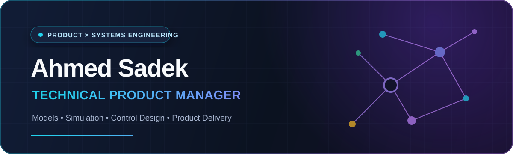

<div align="center">
  
</div>

<div align="center">

I turn complex systems into **clear product decisions, buildable solutions, and measurable outcomes**, combining product strategy with **Models, Simulation & Control Design**.

[](#how-i-build-products)
[](#systems-engineering-foundation)
[](#technical-fluency)
[](#how-i-measure-progress)
[](#how-i-work-with-teams)

[About](#about) · [Systems engineering](#systems-engineering-foundation) · [Selected work](#selected-product-work) · [Product approach](#how-i-build-products) · [Contact](#lets-build-something-useful)

</div>

## About

I’m **Ahmed Sadek**, a Technical Product Manager with a systems engineering foundation and a **PhD in Cyber-Physical Systems**. In academic journals, I publish as **Ahmed Moustafa** and **Ahmed M. Moustafa** through the Computers and Systems Engineering Department at **Minia University**.

My background spans **Models, Simulation & Control Design**, from cyber-physical energy systems and real-time predictive control to autonomous systems and software-in-the-loop vehicle control. It shapes how I approach products: define the system boundary, understand feedback and constraints, make trade-offs visible, and help a cross-functional team move from idea to reliable product.

> **My product principle:** Start with the problem, design around constraints, ship the smallest valuable change, and learn from evidence.

## Systems engineering foundation

I am an Associate Professor in Computers and Systems Engineering at Minia University. My research focuses on **Computer-Controlled Systems** and **Cyber-Physical Systems**, with an emphasis on real-time control, predictive methods, system emulation, and autonomous platforms.

<table>
  <tr>
    <td width="33%" valign="top">
      <h3>Cyber-physical energy systems</h3>
      <p>Research across wind-energy conversion, the Internet of Energy, real-time wind-turbine emulation, and software-defined control for hydrogen-energy storage.</p>
      <p><strong>Product translation:</strong> Design around the full hardware, software, connectivity, control, and operational ecosystem.</p>
      <p><a href="https://scholar.google.com/citations?view_op=view_citation&amp;hl=en&amp;user=iKZKLygAAAAJ&amp;citation_for_view=iKZKLygAAAAJ:Se3iqnhoufwC">Cyber-physical wind-energy survey →</a><br/><a href="https://doi.org/10.1016/j.ijhydene.2023.08.208">Software-defined hydrogen-storage control →</a></p>
    </td>
    <td width="33%" valign="top">
      <h3>Real-time models &amp; predictive control</h3>
      <p>Developed and evaluated real-time emulators, switched model predictive control, hybrid control, and networked control for energy and industrial systems.</p>
      <p><strong>Product translation:</strong> Represent dynamics and constraints explicitly, test behavior under realistic conditions, and validate feasibility before scaling.</p>
      <p><a href="https://scholar.google.com/citations?view_op=view_citation&amp;hl=en&amp;user=iKZKLygAAAAJ&amp;citation_for_view=iKZKLygAAAAJ:5nxA0vEk-isC">Wind-turbine emulator and switched MPC →</a></p>
    </td>
    <td width="33%" valign="top">
      <h3>Autonomous systems &amp; control design</h3>
      <p>Worked on quadrotor tracking autopilots, UAV fractional control, and optimal lane-keeping control using LQR and simulated annealing.</p>
      <p>The <a href="https://github.com/ahmedmmkms/TORCS_Simulink_Client">TORCS Simulink Client</a> provides an S-Function for software-in-the-loop driver-controller development, including cruise-control and lane-keeping demonstrations.</p>
      <p><a href="https://doi.org/10.3390/drones6120379">Quadrotor control study →</a><br/><a href="https://doi.org/10.1109/ICENCO48310.2019.9027294">Lane-keeping control study →</a></p>
    </td>
  </tr>
</table>

<div align="center">

[](https://scholar.google.com/citations?hl=en&user=iKZKLygAAAAJ)
[](mailto:ahmed.mahmoud@mu.edu.eg)
[](https://github.com/ahmedmmkms/TORCS_Simulink_Client)

</div>

## Selected product work

<table>
  <tr>
    <td width="50%" valign="top">
      <h3><a href="https://github.com/ahmedmmkms/whatsapp-commerce-concierge">WhatsApp Commerce Concierge</a></h3>
      <p>An Arabic/English commerce journey spanning WhatsApp and web, from discovery and cart to orders, returns, support, and privacy workflows.</p>
      <p><strong>Product lens:</strong> Omnichannel conversion, MENA localization, accessibility, PDPL-aware operations, and analytics.</p>
      <p><strong>Technical lens:</strong> Next.js, NestJS, PostgreSQL, Redis, queues, Stripe, WhatsApp Cloud API, and CI/CD.</p>
      <p><a href="https://whatsapp-commerce-concierge-web.vercel.app">Live demo →</a></p>
    </td>
    <td width="50%" valign="top">
      <h3><a href="https://github.com/ahmedmmkms/b2b-marketplace">Centralized Procurement Platform</a></h3>
      <p>A bilingual B2B marketplace that connects enterprise buyers and suppliers across catalog, RFQ, quote comparison, approvals, orders, and payments.</p>
      <p><strong>Product lens:</strong> Multi-role workflows, procurement visibility, controlled rollout, and Arabic/English enterprise UX.</p>
      <p><strong>Technical lens:</strong> Next.js, Spring Boot, OpenAPI, PostgreSQL, feature flags, JWT, and cloud deployment.</p>
      <p><a href="https://b2b-marketplace.pages.dev/en">Live demo →</a></p>
    </td>
  </tr>
  <tr>
    <td width="50%" valign="top">
      <h3><a href="https://github.com/ahmedmmkms/last-mile-control-tower">Last-Mile Delivery Control Tower</a></h3>
      <p>An operational control surface for dispatchers and drivers, covering route assignment, live tracking, proof of delivery, COD, and SLA monitoring.</p>
      <p><strong>Product lens:</strong> Operational visibility, exception handling, delivery KPIs, and mobile field workflows.</p>
      <p><strong>Technical lens:</strong> React, Node.js, PostgreSQL, Socket.IO, REST APIs, PWA patterns, tests, and CI/CD.</p>
      <p><a href="https://last-mile-control-tower.vercel.app">Live demo →</a></p>
    </td>
    <td width="50%" valign="top">
      <h3><a href="https://github.com/ahmedmmkms/WPSPayrollCompliance">WPS Payroll Compliance</a></h3>
      <p>A multi-tenant payroll operations product that validates WPS submissions, surfaces anomalies, manages exceptions, and exposes compliance KPIs.</p>
      <p><strong>Product lens:</strong> Regulatory workflows, traceable decisions, exception SLAs, tenant isolation, and bilingual operations.</p>
      <p><strong>Technical lens:</strong> Laravel, Filament, PostgreSQL, Redis, queues, PWA support, automated testing, and blue/green deployment.</p>
      <p><a href="https://github.com/ahmedmmkms/WPSPayrollCompliance">Explore the repository →</a></p>
    </td>
  </tr>
</table>

<div align="center">

[Explore all public projects →](https://github.com/ahmedmmkms?tab=repositories)

</div>

## How I build products

<table>
  <tr>
    <td width="25%" valign="top">
      <strong>01 · Discover</strong><br/><br/>
      Customer interviews<br/>
      Journey mapping<br/>
      Market context<br/>
      Problem validation
    </td>
    <td width="25%" valign="top">
      <strong>02 · Define</strong><br/><br/>
      Product outcomes<br/>
      Success metrics<br/>
      Requirements &amp; scope<br/>
      Prioritization
    </td>
    <td width="25%" valign="top">
      <strong>03 · Deliver</strong><br/><br/>
      Engineering alignment<br/>
      Backlog &amp; release planning<br/>
      Dependency management<br/>
      Risk reduction
    </td>
    <td width="25%" valign="top">
      <strong>04 · Learn</strong><br/><br/>
      Product analytics<br/>
      Customer feedback<br/>
      Experiment review<br/>
      Iteration
    </td>
  </tr>
</table>

I use roadmaps as decision tools, not feature calendars. Every meaningful initiative should connect a customer problem to a product outcome, a delivery plan, and a way to learn.

## Technical fluency

| Area | How I contribute |
|---|---|
| **Models, Simulation & Control Design** | Frame system boundaries, represent dynamics and constraints, test scenarios, and use closed-loop thinking to connect decisions with system behavior. |
| **APIs & data** | Collaborate on contracts, integrations, data flows, edge cases, and the product implications of technical choices. |
| **AI & automation** | Frame useful AI workflows around user value, evaluation, trust, cost, latency, and human oversight. |
| **Delivery** | Turn product intent into testable increments, clear acceptance criteria, release decisions, and visible risks. |
| **Analytics** | Define events and metrics that explain behavior, not just activity, and use them to guide the next decision. |

## How I measure progress

I prefer a small, connected set of measures over a dashboard full of vanity metrics.

| Lens | Questions I ask | Example signals |
|---|---|---|
| **Customer** | Are people reaching value with less friction? | Activation, task success, retention, satisfaction |
| **Business** | Is the product creating sustainable value? | Adoption, conversion, revenue, cost-to-serve |
| **System** | Is the experience dependable at scale? | Availability, latency, error rate, quality |
| **Delivery** | Are we learning and shipping effectively? | Lead time, release confidence, experiment velocity |

## How I work with teams

- **Bring context, not just tickets.** Teams make better decisions when they understand the customer, outcome, and constraints.
- **Make trade-offs explicit.** Scope, quality, speed, and risk should be discussed, not discovered at the deadline.
- **Write for alignment.** Clear problem briefs, decision records, PRDs, and acceptance criteria reduce avoidable ambiguity.
- **Create a learning loop.** Discovery informs delivery; delivery creates evidence; evidence improves the roadmap.
- **Share ownership.** Strong products come from product, design, engineering, data, and go-to-market working as one team.

## Product artifacts I care about

```text
Problem brief  →  Outcome & metrics  →  Solution options  →  Delivery slices
      ↑                                                        ↓
      └────────────── Evidence, decisions & learning ──────────┘
```

The artifact is never the goal. Its value is in helping a team make a better decision: a sharper opportunity brief, an outcome-led roadmap, a testable PRD, a useful decision log, or a release plan everyone understands.

## Let’s build something useful

I’m interested in thoughtful conversations about digital products, platform strategy, AI-enabled workflows, and the craft of turning complex ideas into products people can trust.

<div align="center">

[](https://www.linkedin.com/in/ahmedmmkms/)
[](mailto:ahmed.mahmoud@mu.edu.eg)

<sub>Strategy with evidence · Technology with purpose · Delivery with focus</sub>

</div>

<!--
PROFILE OWNER NOTES (not rendered on GitHub)

1. Enrich the selected projects with outcome metrics when they can be supported by real evidence.
2. A strong case-study format is: Problem → Constraints → My role → Decision → Outcome → Learning.
3. If this is your GitHub profile README, the repository name must exactly match your GitHub username.
-->
