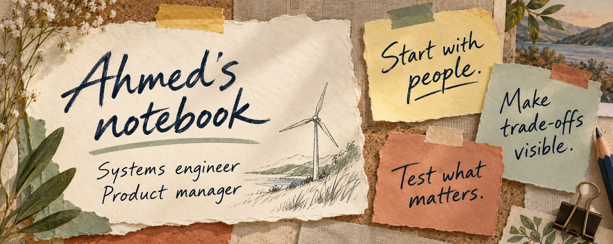

# Hi, I’m Ahmed.

**Systems engineer · Technical product manager · Researcher & teacher**

I’m Ahmed Sadek. My background is in cyber-physical systems, control, and modeling, and I’m an Associate Professor in Computers and Systems Engineering at Minia University.

I enjoy the part of product work where a choice has to be made: what to build first, what to simplify, and what needs more evidence. That’s where I bring my engineering background—especially when software has to work with people, everyday processes, or physical systems.

[LinkedIn](https://www.linkedin.com/in/ahmedmmkms/) · [Research](https://scholar.google.com/citations?hl=en&user=iKZKLygAAAAJ) · [Email](mailto:ahmed.mahmoud@mu.edu.eg)

## From my product notebook

These four **developed concept studies** show how I work through product decisions across AI, healthcare, industrial systems, and school operations. Each includes a concrete scenario, alternatives, testable requirements, a screen walkthrough, and a validation plan. The assumptions are explicit; customer interviews, prototypes, and pilot results are future work.

<table>
  <tr>
    <td width="50%" valign="top">
      
      <h3>AI Operations Copilot</h3>
      
From incident notes to reviewed follow-up tasks: evidence, ambiguity, and the economics of saving a few minutes.

      
<a href="https://github.com/ahmedmmkms/ahmedmmkms/blob/main/portfolio/case-studies/ai-operations-copilot.md">Read the case →</a>

    </td>
    <td width="50%" valign="top">
      
      <h3>Clinical Workflow</h3>
      
Following a laboratory visit from registration to reporting, including mismatched specimens and corrected records.

      
<a href="https://github.com/ahmedmmkms/ahmedmmkms/blob/main/portfolio/case-studies/clinical-workflow.md">Read the case →</a>

    </td>
  </tr>
  <tr>
    <td width="50%" valign="top">
      
      <h3>Predictive Maintenance</h3>
      
Starting with useful signals and explainable alerts before asking a model to predict failures.

      
<a href="https://github.com/ahmedmmkms/ahmedmmkms/blob/main/portfolio/case-studies/predictive-maintenance.md">Read the case →</a>

    </td>
    <td width="50%" valign="top">
      
      <h3>Safe School Pickup</h3>
      
Making pickup easier to coordinate, with clear authorization and a staff-confirmed handover.

      
<a href="https://github.com/ahmedmmkms/ahmedmmkms/blob/main/portfolio/case-studies/safe-school-pickup.md">Read the case →</a>

    </td>
  </tr>
</table>

[**Browse the full catalogue →**](https://github.com/ahmedmmkms/ahmedmmkms/blob/main/portfolio/README.md)

## A few software projects

Code makes the details harder to avoid. These repositories explore the practical side: bilingual interfaces, integrations, operational workflows, and the work behind a usable product.

- **[WhatsApp Commerce Concierge](https://github.com/ahmedmmkms/whatsapp-commerce-concierge)** — a commerce experience across WhatsApp and the web, from browsing to orders and support. [Try the demo](https://whatsapp-commerce-concierge-web.vercel.app).
- **[Centralized Procurement Platform](https://github.com/ahmedmmkms/b2b-marketplace)** — catalogs, requests for quotes, supplier comparisons, and purchasing workflows. [Try the demo](https://b2b-marketplace.pages.dev/en).
- **[Last-Mile Delivery Control Tower](https://github.com/ahmedmmkms/last-mile-control-tower)** — dispatch, tracking, proof of delivery, and operational exceptions. [Try the demo](https://last-mile-control-tower.vercel.app).
- **[WPS Payroll Compliance](https://github.com/ahmedmmkms/WPSPayrollCompliance)** — payroll validation, exception handling, and audit workflows.

The tools behind the work

Python, MATLAB, Simulink, and C++ are part of my engineering background. The software repositories also explore web applications, APIs, databases, cloud deployment, and AI integration.

- Commerce: Next.js, NestJS, PostgreSQL, Redis, WhatsApp API.
- Procurement: Next.js, Spring Boot, OpenAPI, PostgreSQL.
- Delivery: React, Node.js, PostgreSQL, Socket.IO.
- Payroll: Laravel, Filament, PostgreSQL, queues.

[All public repositories](https://github.com/ahmedmmkms?tab=repositories)

## The engineering side of me

I have a PhD in Cyber-Physical Systems. My research includes wind-energy systems, real-time control, system emulation, and autonomous platforms. That work keeps me interested in what happens beyond the screen: timing, uncertainty, physical constraints, and how a system behaves when conditions change.

You’ll find my papers under **Ahmed Moustafa** and **Ahmed M. Moustafa**.

- **Energy systems:** [wind-energy survey](https://scholar.google.com/citations?view_op=view_citation&hl=en&user=iKZKLygAAAAJ&citation_for_view=iKZKLygAAAAJ:Se3iqnhoufwC) and [hydrogen-storage control](https://doi.org/10.1016/j.ijhydene.2023.08.208).
- **Real-time control:** [wind-turbine emulation and model predictive control](https://scholar.google.com/citations?view_op=view_citation&hl=en&user=iKZKLygAAAAJ&citation_for_view=iKZKLygAAAAJ:5nxA0vEk-isC).
- **Autonomous systems:** [quadrotor control](https://doi.org/10.3390/drones6120379), [lane keeping](https://doi.org/10.1109/ICENCO48310.2019.9027294), and the [TORCS Simulink Client](https://github.com/ahmedmmkms/TORCS_Simulink_Client).

## How I approach a product problem

I start with the work someone is trying to do. Then I look at the constraints, compare a few realistic options, and choose a small enough scope to learn from.

A few questions keep me honest: **What evidence supports this? What are we giving up? What would make us change our minds?**

Teaching and research are part of this picture too. I want the reasoning to be clear enough for someone else to question it, whether it ends up in a classroom, a technical discussion, or a product decision.

[More about my approach](https://github.com/ahmedmmkms/ahmedmmkms/blob/main/portfolio/approach.md) · [Systems thinking in practice](https://github.com/ahmedmmkms/ahmedmmkms/blob/main/portfolio/systems-thinking.md)

## Say hello

If you’re working on a product where the engineering and the day-to-day workflow are tightly connected, I’d be glad to compare notes.

[**Find me on LinkedIn**](https://www.linkedin.com/in/ahmedmmkms/) · [**Send me an email**](mailto:ahmed.mahmoud@mu.edu.eg)

Illustrations and handwritten boards are editorial artwork. Project details and evidence live in the linked pages.
