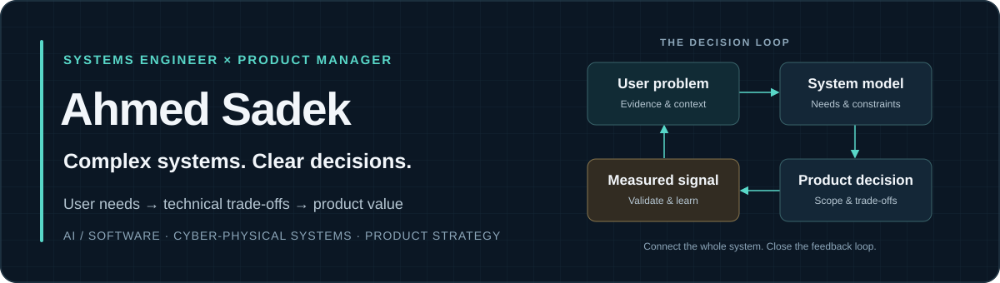

  

### I turn complex technical systems into useful, measurable products.

Product judgment · Systems engineering · Software &amp; AI

[**Explore the case catalogue →**](https://github.com/ahmedmmkms/ahmedmmkms/blob/main/portfolio/README.md) · [LinkedIn](https://www.linkedin.com/in/ahmedmmkms/) · [Google Scholar](https://scholar.google.com/citations?hl=en&user=iKZKLygAAAAJ)

[Profile](#profile) · [Product cases](#product-case-catalogue) · [Software projects](#selected-software-projects) · [Systems &amp; research](#systems-engineering-and-research) · [Approach](#how-i-make-product-decisions) · [Contact](#contact)

## Profile

I’m **Ahmed Sadek**, a **systems engineer and technical product manager** with a PhD in Cyber-Physical Systems. I bring product thinking to technically complex problems: understand the workflow, define the system boundary, weigh alternatives, and turn requirements into testable product decisions.

My focus spans **AI-assisted workflows, B2B platforms, healthcare digitization, and industrial systems**. I connect user and business needs with architecture, data, operational constraints, and a plan to measure value.

Associate Professor, Computers and Systems Engineering, Minia University · Academic publishing names: <strong>Ahmed Moustafa</strong> and <strong>Ahmed M. Moustafa</strong>

## Product case catalogue

**Four concept product case studies, currently at the foundation stage.** Each entry introduces a problem hypothesis, a proposed decision, and a validation plan. These are independent portfolio concepts; research, pilots, and measured outcomes are still to be established.

<table>
  <tr>
    <td width="50%" valign="top">
      <h3>01 · AI Operations Copilot</h3>
      
AI PRODUCT MANAGEMENT · B2B WORKFLOWS

      
Turn fragmented operational information into actions that people can review and trace to their source.

      
<strong>Proposed decision:</strong> assist with extraction and prioritization; require human approval before an action is committed.

      
LLM evaluation · Human review · Cost / latency / quality

      
<a href="https://github.com/ahmedmmkms/ahmedmmkms/blob/main/portfolio/case-studies/ai-operations-copilot.md">Explore the concept →</a>

    </td>
    <td width="50%" valign="top">
      <h3>02 · Clinical Workflow Platform</h3>
      
HEALTHTECH · DATA &amp; TRACEABILITY

      
Connect registration, clinical data, specimens, and reporting through a traceable workflow.

      
<strong>Proposed decision:</strong> establish identity, structured intake, and auditable handoffs before adding automation.

      
Requirements · Data quality · Phased digitization

      
<a href="https://github.com/ahmedmmkms/ahmedmmkms/blob/main/portfolio/case-studies/clinical-workflow.md">Explore the concept →</a>

    </td>
  </tr>
  <tr>
    <td width="50%" valign="top">
      <h3>03 · Industrial Predictive Maintenance</h3>
      
INDUSTRIAL / IoT · RELIABILITY

      
Connect asset signals to maintenance decisions that technicians can understand and act on.

      
<strong>Proposed decision:</strong> begin with visibility, thresholds, and anomaly detection; gate predictive ML on useful failure data.

      
Trade studies · Edge / cloud · False-alarm control

      
<a href="https://github.com/ahmedmmkms/ahmedmmkms/blob/main/portfolio/case-studies/predictive-maintenance.md">Explore the concept →</a>

    </td>
    <td width="50%" valign="top">
      <h3>04 · Safe School Pickup</h3>
      
MULTI-SIDED PRODUCT · TRUST &amp; OPERATIONS

      
Coordinate guardians, school staff, and release confirmation through a clear pickup workflow.

      
<strong>Proposed decision:</strong> verify identity and pickup authorization, then require staff confirmation for release.

      
Service journey · Authorization · Exception handling

      
<a href="https://github.com/ahmedmmkms/ahmedmmkms/blob/main/portfolio/case-studies/safe-school-pickup.md">Explore the concept →</a>

    </td>
  </tr>
</table>

**Read in two depths:** start with the decision snapshot; follow the artifact links to inspect assumptions, trade-offs, requirements, risks, and measurement plans.

## How I make product decisions

**Discover → Model → Prioritize → Decide → Deliver → Measure → Learn**

| Product question | Systems engineering contribution | Reviewable artifact |
|---|---|---|
| Whose problem matters, and why? | Map users, stakeholders, and system boundaries | Problem brief + evidence / assumption register |
| What should we build first? | Expose dependencies, alternatives, and failure modes | Decision snapshot + scoped MVP |
| What does “good” mean? | Translate needs into testable behavior | Requirements traceability + acceptance criteria |
| How will we know it works? | Connect validation to user and business outcomes | KPI tree + guardrails + learning plan |

I use prioritization models and trade studies to support judgment. **Evidence confidence, operational risk, and the cost of being wrong matter alongside feature value.**

[Read my decision approach →](https://github.com/ahmedmmkms/ahmedmmkms/blob/main/portfolio/approach.md) · [Systems thinking in practice →](https://github.com/ahmedmmkms/ahmedmmkms/blob/main/portfolio/systems-thinking.md)

## Selected software projects

These repositories provide a separate view of software implementation and architecture. Their documented scope is distinct from the four concept studies above.

| Project | Workflow explored | Technical foundation |
|---|---|---|
| [**WhatsApp Commerce Concierge**](https://github.com/ahmedmmkms/whatsapp-commerce-concierge) | Bilingual discovery, checkout, orders, returns, and support across WhatsApp and web | Next.js · NestJS · PostgreSQL · Redis · WhatsApp API |
| [**Centralized Procurement Platform**](https://github.com/ahmedmmkms/b2b-marketplace) | Catalogs, RFQs, quote comparison, approvals, and orders | Next.js · Spring Boot · OpenAPI · PostgreSQL |
| [**Last-Mile Delivery Control Tower**](https://github.com/ahmedmmkms/last-mile-control-tower) | Dispatch, tracking, proof of delivery, COD, and operational exceptions | React · Node.js · PostgreSQL · Socket.IO |
| [**WPS Payroll Compliance**](https://github.com/ahmedmmkms/WPSPayrollCompliance) | Payroll validation, exceptions, tenant isolation, and audit workflows | Laravel · Filament · PostgreSQL · Queues |

**Live demos:** [WhatsApp Commerce Concierge](https://whatsapp-commerce-concierge-web.vercel.app) · [Procurement Platform](https://b2b-marketplace.pages.dev/en) · [Delivery Control Tower](https://last-mile-control-tower.vercel.app)

<strong>Browse more technical work</strong>

- [TORCS Simulink Client](https://github.com/ahmedmmkms/TORCS_Simulink_Client) — simulation and control integration.
- [MATLAB / Simulink Modeling](https://github.com/ahmedmmkms/MATLAB_Simulink_Modeling_Liebgott) — modeling resources and engineering exercises.
- [Operations Research](https://github.com/ahmedmmkms/Operations_Research) — quantitative decision-making resources.
- [All public repositories →](https://github.com/ahmedmmkms?tab=repositories)

## Systems engineering and research

My research spans **computer-controlled and cyber-physical systems**: real-time control, predictive methods, system emulation, and autonomous platforms. It shapes how I reason about product behavior, interfaces, reliability, and feedback.

| Research theme | Selected work | Product relevance |
|---|---|---|
| **Cyber-physical energy** | [Wind-energy survey](https://scholar.google.com/citations?view_op=view_citation&hl=en&user=iKZKLygAAAAJ&citation_for_view=iKZKLygAAAAJ:Se3iqnhoufwC) · [Hydrogen-storage control](https://doi.org/10.1016/j.ijhydene.2023.08.208) | Physical constraints, integration, and system-level trade-offs |
| **Real-time control** | [Wind-turbine emulator and MPC](https://scholar.google.com/citations?view_op=view_citation&hl=en&user=iKZKLygAAAAJ&citation_for_view=iKZKLygAAAAJ:5nxA0vEk-isC) | Modeling behavior, timing constraints, and validation |
| **Autonomous systems** | [Quadrotor study](https://doi.org/10.3390/drones6120379) · [Lane-keeping study](https://doi.org/10.1109/ICENCO48310.2019.9027294) | Estimation, uncertainty, and closed-loop decisions |

<strong>What I bring across product, systems, and technology</strong>

| Product | Systems | Technical |
|---|---|---|
| Discovery &amp; problem framing | Requirements &amp; traceability | Python · MATLAB · Simulink · C++ |
| Prioritization &amp; MVP scope | Architecture &amp; interfaces | Software / cloud · APIs &amp; integration |
| Strategy &amp; roadmaps | Modeling &amp; simulation | AI / ML · Data workflows |
| Metrics &amp; learning | Risk &amp; verification | Industrial / control systems |

## Contact

Interested in technically complex product problems? **Let’s connect.** I’m interested in technical product management, AI-assisted workflows, platforms, and products built for operational environments.

[**LinkedIn →**](https://www.linkedin.com/in/ahmedmmkms/) · [Academic email](mailto:ahmed.mahmoud@mu.edu.eg) · [Research profile](https://scholar.google.com/citations?hl=en&user=iKZKLygAAAAJ)
