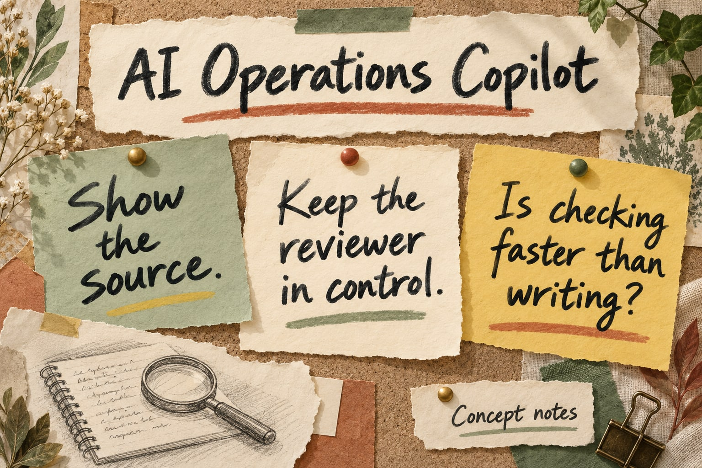
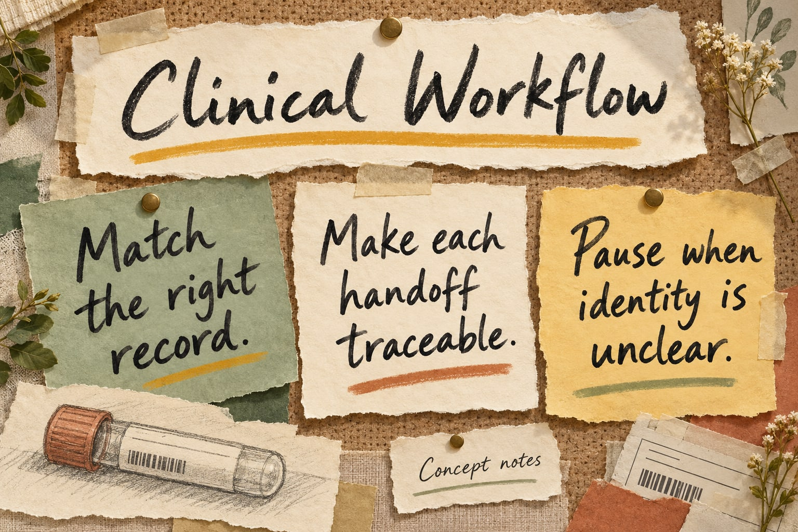
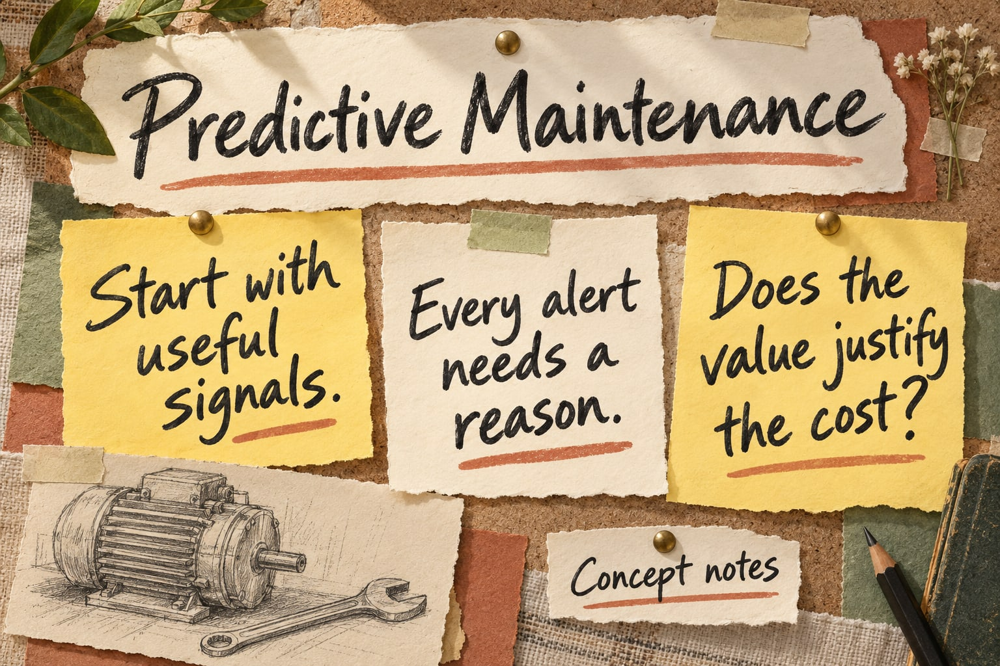
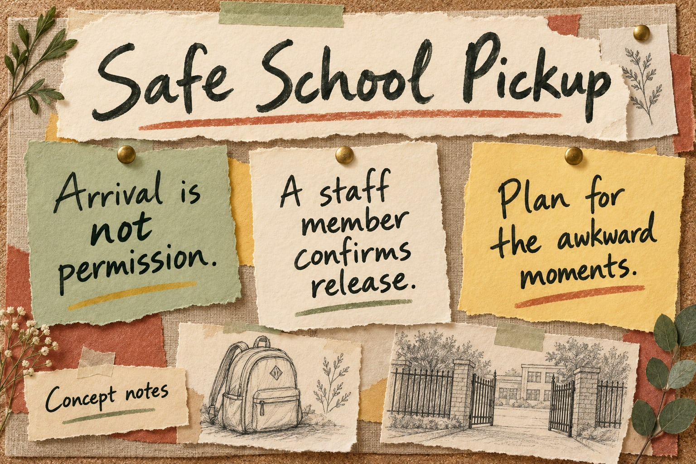

# The product notebook

[← Back to my profile](../README.md) · [How I work through decisions](approach.md)

Four cases, each starting with a question I want to work through. The handwritten boards capture the choices that matter; the pages below open up the assumptions, trade-offs, and engineering behind them.

These are **developed concept studies**. Each works through a specific assumed setting, sourced principles, product requirements, alternatives, economics, and a validation plan. Each also includes six proposed screens and short interview walkthroughs. Customer interviews, working prototypes, and pilot outcomes have not been completed.

## AI Operations Copilot

Can an assistant turn incident notes into useful follow-up tasks without making the reviewer’s job harder? This case compares a structured template and three model approaches, then examines source evidence, ambiguity, evaluation, and the break-even point.

[**Read the AI case →**](case-studies/ai-operations-copilot.md)

## Clinical Workflow Platform

Registration, records, specimens, and reports all depend on reliable handoffs. This concept starts with identity and traceability before adding more automation.

[**Read the clinical workflow case →**](case-studies/clinical-workflow.md)

## Industrial Predictive Maintenance

A sensor reading matters when it helps someone make a maintenance decision. I’m exploring how far visibility and explainable alerts can take a first release, and what evidence would justify predictive ML.

[**Read the maintenance case →**](case-studies/predictive-maintenance.md)

## Safe School Pickup

Pickup needs to be practical for families and staff, with clear authority for releasing a child. This case looks at the normal handover and the exceptions that can complicate it.

[**Read the school pickup case →**](case-studies/safe-school-pickup.md)

---

## A little more depth

Each page starts with the problem and my proposed choice. Expand the detail to inspect acceptance tests, data contracts, risks, measurement, and rollout gates. The calculations show their assumptions, including scenarios where the investment would not pay back.

- [My decision approach](approach.md)
- [Systems thinking in practice](systems-thinking.md)
- [Worked product artifacts](templates/product-artifacts.md)
- [How to read the cases](templates/case-study.md)
- [Current content status](../docs/content-status.md)

The cover artwork is illustrative. The [software projects and research on my profile](../README.md) have their own repository and publication links.
