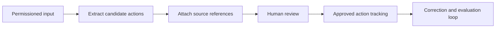

# AI Operations Copilot

[← Catalogue](../README.md) · [Decision approach](../approach.md) · [Case template](../templates/case-study.md)

**Concept Product Case Study · Foundation stage**

AI product management · B2B workflows

This is an independent portfolio concept. The workflow, users, and proposed product direction below require validation. No customer research, implementation, deployment, or measured outcome is claimed.

## 30-second snapshot

| Question | Concept direction |
|---|---|
| Problem hypothesis | Operational information spread across tickets, notes, and documents may make it difficult to identify and track actionable work. |
| Intended users — assumed | Engineering coordinators, operations leads, and reviewers; target segment requires validation. |
| My role in this portfolio entry | Concept framing and proposed decision structure; discovery and delivery have not been established |
| Proposed key decision | Produce source-linked action suggestions and require human approval before committing an action. |
| Intended outcome | Reduce the effort needed to turn information into a correct, reviewable action; baseline and target remain unset. |
| Primary trade-off | Retain reviewer effort in exchange for control, source traceability, and a visible correction loop. |

## Decision snapshot

**Proposed decision:** Produce source-linked action suggestions and require human approval before committing an action.

**Why it matters:** Reduce the effort needed to turn information into a correct, reviewable action; baseline and target remain unset.

**Alternatives to compare:** Manual triage; deterministic extraction; LLM-assisted extraction; autonomous action creation.

**Decision drivers:** Action correctness, reviewer workload, privacy, processing cost, latency, and integration effort.

**Trade-off accepted in the concept:** Retain reviewer effort in exchange for control, source traceability, and a visible correction loop.

**Risk introduced or remaining:** Unsupported suggestions could be accepted or sensitive source content could reach an unsuitable processing service.

**Proposed validation:** Observe a real workflow, collect permissioned or synthetic samples, and compare manual processing with assisted review.

## Evidence and assumptions

The supplied portfolio brief provides the concept direction. It does not provide domain-specific observations or results.

| ID | Assumption | Confidence | Impact | Validation method | Status |
|---|---|---|---|---|---|
| A01 | A significant part of the workflow is spent manually consolidating unstructured information. | Low | High | Observe a real workflow, collect permissioned or synthetic samples, and compare manual processing with assisted review. | Open |

[INPUT REQUIRED: provide permissioned observations, workflow examples, or datasets before describing real user pain or outcomes.]

## Proposed MVP boundary

**In scope:** One agreed document type, action extraction, source references, reviewer edits, and a review log.

**Non-goals:** Autonomous execution, broad connector coverage, and claims of an enterprise-ready copilot.

This scope is a starting hypothesis. A detailed PRD, prioritized backlog, delivery plan, and acceptance criteria are still pending.

## Illustrative system context

This diagram is a concept workflow, not an implemented or deployed architecture.

## Measurement plan

All entries are proposed measurements. Baselines, numeric targets, and results have not been supplied.

| Candidate measure | How it would be assessed |
|---|---|
| Extraction precision | Label a task dataset and assess candidate actions against agreed reference labels. |
| Unsupported-action rate | Count suggestions that cannot be supported by their cited source. |
| Reviewer effort and acceptance | Time comparable tasks and record acceptance, edits, and rejection reasons. |
| Latency and unit cost | Record end-to-end processing times and cost per document under specified load. |

## Primary risk

**Failure to examine:** Unsupported suggestions could be accepted or sensitive source content could reach an unsuitable processing service.

**Proposed controls to verify:** Source citations, explicit approval, permission-aware input handling, and a task-specific evaluation set.

[Use the risk and requirements templates →](../templates/product-artifacts.md)

<strong>Technical appendix — planned depth</strong>

Document schema, source-span references, reviewer state, model comparison, evaluation protocol, and permission boundaries.

[INPUT REQUIRED: supply system constraints and evidence before completing the appendix.]

[Reusable technical appendix template](../templates/product-artifacts.md#technical-appendix)

## Next learning step

Target user and operating context; actual input types; integrations; privacy requirements; current processing workflow; available observations and baseline metrics.

The [full case-study template](../templates/case-study.md) defines the remaining discovery, requirements, prioritization, roadmap, validation, rollout, and reflection sections.
