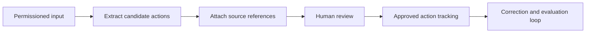

# AI Operations Copilot

[← All cases](../README.md) · [My approach](../approach.md)

*Concept study · In progress*

An AI assistant is useful here only if checking its suggestions takes less effort than doing the work manually. That is the question I want this case to answer.

The idea is to help engineering and operations teams turn tickets, notes, and documents into reviewable actions. I’m starting with the handoff between a suggestion and a person who has to decide whether to trust it.

## The choice I’m exploring

My starting point is a small assistant that shows where each suggestion came from and lets a reviewer accept, edit, or reject it. The person keeps control of what becomes an action.

That adds a review step. It also gives us a way to inspect mistakes and find out whether the assistance is actually saving effort. I would begin with one type of document before investing in a long list of integrations.

## What I would test first

- Compare manual processing with assisted review on the same representative tasks.
- Check whether each proposed action is supported by its cited source.
- Record edits and rejection reasons, as well as acceptance.
- Measure review time, processing latency, and cost together.

## Where it stands

The next step is to choose a specific user group and input type, then establish the current workflow and privacy boundary. This remains a concept; user research and results are still to come.

<strong>Open the working notes: assumptions, scope, metrics, and technical detail</strong>

## Evidence and assumptions

These are the starting assumptions. They need workflow observations or representative data before they can support a product decision.

| ID | Assumption | Confidence | Impact | Validation method | Status |
|---|---|---|---|---|---|
| A01 | A significant part of the workflow is spent manually consolidating unstructured information. | Low | High | Observe a real workflow, collect permissioned or synthetic samples, and compare manual processing with assisted review. | Open |

Evidence still needed: permissioned observations, workflow examples, or representative datasets.

## Proposed MVP boundary

**In scope:** One agreed document type, action extraction, source references, reviewer edits, and a review log.

**Non-goals:** Autonomous execution, broad connector coverage, and claims of an enterprise-ready copilot.

This scope is a starting hypothesis. A detailed PRD, prioritized backlog, delivery plan, and acceptance criteria are still pending.

## Illustrative system context

This diagram is a concept workflow, not an implemented or deployed architecture.

## Measurement plan

All entries are proposed measurements. Baselines, numeric targets, and results have not been supplied.

| Candidate measure | How it would be assessed |
|---|---|
| Extraction precision | Label a task dataset and assess candidate actions against agreed reference labels. |
| Unsupported-action rate | Count suggestions that cannot be supported by their cited source. |
| Reviewer effort and acceptance | Time comparable tasks and record acceptance, edits, and rejection reasons. |
| Latency and unit cost | Record end-to-end processing times and cost per document under specified load. |

## Primary risk

**Failure to examine:** Unsupported suggestions could be accepted or sensitive source content could reach an unsuitable processing service.

**Proposed controls to verify:** Source citations, explicit approval, permission-aware input handling, and a task-specific evaluation set.

[Use the risk and requirements templates →](../templates/product-artifacts.md)

### Further technical work

Document schema, source-span references, reviewer state, model comparison, evaluation protocol, and permission boundaries.

The system constraints and supporting evidence still need to be established.

[Reusable technical appendix template](../templates/product-artifacts.md#technical-appendix)

[Case-study structure](../templates/case-study.md) · [Reusable product artifacts](../templates/product-artifacts.md)
