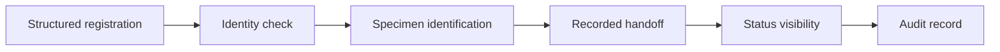

# Clinical Workflow Platform

[← Catalogue](../README.md) · [Decision approach](../approach.md) · [Case template](../templates/case-study.md)

**Concept Product Case Study · Foundation stage**

HealthTech · Workflow traceability

This is an independent portfolio concept. The workflow, users, and proposed product direction below require validation. No customer research, implementation, deployment, or measured outcome is claimed.

## 30-second snapshot

| Question | Concept direction |
|---|---|
| Problem hypothesis | Disconnected registration, specimen, and reporting handoffs may create duplicate entry, missing information, or poor status visibility. |
| Intended users — assumed | Registration staff, clinical staff, laboratory teams, and workflow administrators; exact setting is unconfirmed. |
| My role in this portfolio entry | Concept framing and proposed decision structure; discovery and delivery have not been established |
| Proposed key decision | Establish identity, structured intake, and auditable handoffs before adding workflow automation. |
| Intended outcome | Make an agreed handoff traceable from record creation to completion; baseline and target remain unset. |
| Primary trade-off | Limit initial automation and scope in exchange for dependable identity and workflow data. |

## Decision snapshot

**Proposed decision:** Establish identity, structured intake, and auditable handoffs before adding workflow automation.

**Why it matters:** Make an agreed handoff traceable from record creation to completion; baseline and target remain unset.

**Alternatives to compare:** Improve the manual process; introduce standalone forms; implement a narrow traceable workflow; replace the complete system.

**Decision drivers:** Identity correctness, data completeness, staff effort, auditability, integration boundaries, and rollout disruption.

**Trade-off accepted in the concept:** Limit initial automation and scope in exchange for dependable identity and workflow data.

**Risk introduced or remaining:** A patient or specimen could be associated with the wrong record; permissions could expose sensitive data.

**Proposed validation:** Map an actual, sanitized workflow and walk through synthetic records with the participating roles.

## Evidence and assumptions

The supplied portfolio brief provides the concept direction. It does not provide domain-specific observations or results.

| ID | Assumption | Confidence | Impact | Validation method | Status |
|---|---|---|---|---|---|
| A01 | The selected workflow has manual handoffs and incomplete status visibility. | Low | High | Map an actual, sanitized workflow and walk through synthetic records with the participating roles. | Open |

[INPUT REQUIRED: provide permissioned observations, workflow examples, or datasets before describing real user pain or outcomes.]

## Proposed MVP boundary

**In scope:** A narrowly selected intake-to-specimen handoff with structured fields, status history, and exception handling.

**Non-goals:** Diagnostic recommendations, replacement of every clinical system, and use of real identifying patient data in portfolio examples.

This scope is a starting hypothesis. A detailed PRD, prioritized backlog, delivery plan, and acceptance criteria are still pending.

## Illustrative system context

This diagram is a concept workflow, not an implemented or deployed architecture.

## Measurement plan

All entries are proposed measurements. Baselines, numeric targets, and results have not been supplied.

| Candidate measure | How it would be assessed |
|---|---|
| Record completeness | Check required fields and exceptions in a defined synthetic workflow. |
| Matching errors | Test duplicate identifiers, mismatches, and correction paths. |
| Handoff duration | Define start and end events and establish a baseline before choosing a target. |
| Audit coverage | Verify that agreed status changes and corrections can be reconstructed. |

## Primary risk

**Failure to examine:** A patient or specimen could be associated with the wrong record; permissions could expose sensitive data.

**Proposed controls to verify:** Explicit identity checks, unique specimen identifiers, role-based access, audit events, and mismatch scenario tests.

[Use the risk and requirements templates →](../templates/product-artifacts.md)

<strong>Technical appendix — planned depth</strong>

Need-to-requirement traceability, identity model, role permissions, status transitions, audit events, and integration assumptions.

[INPUT REQUIRED: supply system constraints and evidence before completing the appendix.]

[Reusable technical appendix template](../templates/product-artifacts.md#technical-appendix)

## Next learning step

Care setting and actual workflow; participating roles; identity and specimen conventions; existing systems; sanitized pain-point evidence; applicable privacy constraints.

The [full case-study template](../templates/case-study.md) defines the remaining discovery, requirements, prioritization, roadmap, validation, rollout, and reflection sections.
