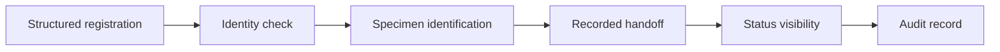

# Clinical Workflow Platform

[← All cases](../README.md) · [My approach](../approach.md)

*Concept study · In progress*

A digital form can be easy to complete and still leave the next person without the information they need. This case looks at the handoffs around registration, clinical records, specimens, and reporting.

I’m interested in a narrow question first: can a team reliably tell what a record belongs to, where it is in the process, and what should happen next?

## The choice I’m exploring

I would start with identity, structured intake, and a visible history of handoffs. More automation can follow once those foundations are dependable.

The trade-off is a smaller first release. I think that is worth exploring because automating an unclear workflow can make its mistakes travel faster. The actual scope still needs to come from observing a specific care setting.

## What I would test first

- Walk through a small workflow with the people responsible for each handoff.
- Use synthetic records to test duplicates, mismatches, and corrections.
- Check whether required information reaches the next role.
- Establish current handoff times before setting improvement targets.

## Where it stands

The next step is to map a real, sanitized workflow and understand the existing systems, roles, and identity conventions. The case is still conceptual; no patient data or deployment results are presented.

<strong>Open the working notes: assumptions, scope, metrics, and technical detail</strong>

## Evidence and assumptions

These are the starting assumptions. They need workflow observations or representative data before they can support a product decision.

| ID | Assumption | Confidence | Impact | Validation method | Status |
|---|---|---|---|---|---|
| A01 | The selected workflow has manual handoffs and incomplete status visibility. | Low | High | Map an actual, sanitized workflow and walk through synthetic records with the participating roles. | Open |

Evidence still needed: permissioned observations, workflow examples, or representative datasets.

## Proposed MVP boundary

**In scope:** A narrowly selected intake-to-specimen handoff with structured fields, status history, and exception handling.

**Non-goals:** Diagnostic recommendations, replacement of every clinical system, and use of real identifying patient data in portfolio examples.

This scope is a starting hypothesis. A detailed PRD, prioritized backlog, delivery plan, and acceptance criteria are still pending.

## Illustrative system context

This diagram is a concept workflow, not an implemented or deployed architecture.

## Measurement plan

All entries are proposed measurements. Baselines, numeric targets, and results have not been supplied.

| Candidate measure | How it would be assessed |
|---|---|
| Record completeness | Check required fields and exceptions in a defined synthetic workflow. |
| Matching errors | Test duplicate identifiers, mismatches, and correction paths. |
| Handoff duration | Define start and end events and establish a baseline before choosing a target. |
| Audit coverage | Verify that agreed status changes and corrections can be reconstructed. |

## Primary risk

**Failure to examine:** A patient or specimen could be associated with the wrong record; permissions could expose sensitive data.

**Proposed controls to verify:** Explicit identity checks, unique specimen identifiers, role-based access, audit events, and mismatch scenario tests.

[Use the risk and requirements templates →](../templates/product-artifacts.md)

### Further technical work

Need-to-requirement traceability, identity model, role permissions, status transitions, audit events, and integration assumptions.

The system constraints and supporting evidence still need to be established.

[Reusable technical appendix template](../templates/product-artifacts.md#technical-appendix)

[Case-study structure](../templates/case-study.md) · [Reusable product artifacts](../templates/product-artifacts.md)
