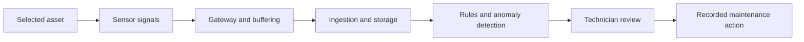

# Industrial Predictive Maintenance

[← All cases](../README.md) · [My approach](../approach.md)

*Concept study · In progress*

An alert has to help someone decide what to do. For this case, I’m starting with that maintenance decision and working back to the signals and analysis it needs.

This is close to my engineering interests: physical systems, imperfect measurements, and behavior that changes with operating conditions.

## The choice I’m exploring

My proposed first step is condition visibility, fixed thresholds, and simple anomaly detection for one asset class. Predictive ML becomes an option when the failure data and operating value justify it.

That means giving up some predictive ambition at the beginning. In return, technicians would have alerts they can inspect, and the pilot could help establish whether the signals are useful enough to build on.

## What I would test first

- Inspect the available signals and maintenance history before choosing an analysis method.
- Replay normal and abnormal behavior to examine false alarms and missed events.
- Observe what a technician does after an alert.
- Measure data availability and maintenance effort alongside model performance.

## Where it stands

The next step is to choose an asset class and examine representative sensor and failure data. This is a concept direction, with no pilot performance or maintenance savings claimed.

<strong>Open the working notes: assumptions, scope, metrics, and technical detail</strong>

## Evidence and assumptions

These are the starting assumptions. They need workflow observations or representative data before they can support a product decision.

| ID | Assumption | Confidence | Impact | Validation method | Status |
|---|---|---|---|---|---|
| A01 | Useful operating signals exist, but representative labeled failure histories may be insufficient for predictive ML. | Low | High | Inspect permissioned asset data, maintenance logs, failure histories, and the current alert-to-action workflow. | Open |

Evidence still needed: permissioned observations, workflow examples, or representative datasets.

## Proposed MVP boundary

**In scope:** One asset class, agreed signals, condition visibility, explainable alerts, and a logged maintenance response.

**Non-goals:** Guaranteed failure prediction, autonomous shutdown or control, and fleet-wide deployment before a representative pilot.

This scope is a starting hypothesis. A detailed PRD, prioritized backlog, delivery plan, and acceptance criteria are still pending.

## Illustrative system context

This diagram is a concept workflow, not an implemented or deployed architecture.

## Measurement plan

All entries are proposed measurements. Baselines, numeric targets, and results have not been supplied.

| Candidate measure | How it would be assessed |
|---|---|
| Actionable-alert rate | Label reviewed alerts and track whether they support a justified maintenance action. |
| Missed events and false alarms | Replay representative normal and abnormal signals with explicit reference labels. |
| Signal availability | Record missing readings, stale data, and gateway interruptions. |
| Maintenance value | Establish downtime, response effort, and maintenance cost baselines before claiming improvement. |

## Primary risk

**Failure to examine:** Missed events or frequent false alarms could create misplaced confidence or excessive technician workload.

**Proposed controls to verify:** Retain existing maintenance practices, expose data availability, record alert handling, and evaluate missed events alongside false alarms.

[Use the risk and requirements templates →](../templates/product-artifacts.md)

### Further technical work

Signal definitions, sampling assumptions, edge buffering, threshold rationale, alternative comparison, lightweight FMEA, and pilot gates.

The system constraints and supporting evidence still need to be established.

[Reusable technical appendix template](../templates/product-artifacts.md#technical-appendix)

[Case-study structure](../templates/case-study.md) · [Reusable product artifacts](../templates/product-artifacts.md)
