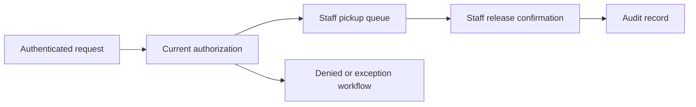

# Safe School Pickup

[← All cases](../README.md) · [My approach](../approach.md)

*Concept study · In progress*

Pickup brings several people into one short, busy moment: a guardian, a child, school staff, and often a coordinator at the gate. This case explores how to make that handover easier to follow.

The important product choice is who is allowed to authorize release, and how staff can confirm that the handover is complete.

## The choice I’m exploring

I would combine an authenticated request, a current pickup authorization, and a staff-confirmed release. Location could help organize the queue; it would not authorize a child’s release.

Those checks create extra steps, so the workflow has to make them practical for staff. Exceptions—revoked permission, a duplicate request, an outage—need as much attention as the normal pickup.

## What I would test first

- Map the school’s existing pickup and exception procedures.
- Walk through permission changes, identity mismatches, and duplicate requests using synthetic scenarios.
- Check whether staff can reconstruct who authorized and confirmed a release.
- Measure queue time and staff effort before proposing speed targets.

## Where it stands

The next step is to agree on one school workflow and understand its staffing, identity checks, connectivity, and emergency procedures. This is early concept work, with no school pilot or safety outcome claimed.

<strong>Open the working notes: assumptions, scope, metrics, and technical detail</strong>

## Evidence and assumptions

These are the starting assumptions. They need workflow observations or representative data before they can support a product decision.

| ID | Assumption | Confidence | Impact | Validation method | Status |
|---|---|---|---|---|---|
| A01 | Pickup delays and authorization exceptions are material problems in the selected school workflow. | Low | High | Map school procedures, observe coordination without collecting identifying child data, and test synthetic pickup scenarios. | Open |

Evidence still needed: permissioned observations, workflow examples, or representative datasets.

## Proposed MVP boundary

**In scope:** Guardian request, authorization check, staff queue, release confirmation, and an audit record for one agreed pickup process.

**Non-goals:** GPS-based release authorization, unattended child release, and broad surveillance or continuous location retention.

This scope is a starting hypothesis. A detailed PRD, prioritized backlog, delivery plan, and acceptance criteria are still pending.

## Illustrative system context

This diagram is a concept workflow, not an implemented or deployed architecture.

## Measurement plan

All entries are proposed measurements. Baselines, numeric targets, and results have not been supplied.

| Candidate measure | How it would be assessed |
|---|---|
| Authorization correctness | Test revoked permissions, identity mismatches, expired sessions, and duplicate requests. |
| Release traceability | Reconstruct request, authorization, staff confirmation, and exception events. |
| Queue and staff effort | Define timing boundaries and establish the current baseline before selecting targets. |
| Adoption and recovery | Observe task completion and scenario performance during connectivity or permission failures. |

## Primary risk

**Failure to examine:** A stale or revoked pickup permission could be used, or an outage could obscure release status.

**Proposed controls to verify:** Check current authorization at release, require staff confirmation, detect duplicate releases, and define an accountable supervised fallback.

[Use the risk and requirements templates →](../templates/product-artifacts.md)

### Further technical work

Roles and permissions, authorization freshness, release state machine, audit events, duplicate prevention, and outage scenarios.

The system constraints and supporting evidence still need to be established.

[Reusable technical appendix template](../templates/product-artifacts.md#technical-appendix)

[Case-study structure](../templates/case-study.md) · [Reusable product artifacts](../templates/product-artifacts.md)
