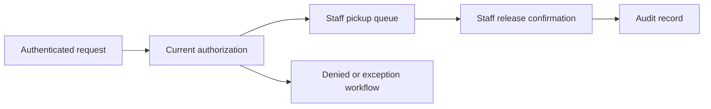

# Safe School Pickup

[← Catalogue](../README.md) · [Decision approach](../approach.md) · [Case template](../templates/case-study.md)

**Concept Product Case Study · Foundation stage**

Multi-sided product · Trust and operations

This is an independent portfolio concept. The workflow, users, and proposed product direction below require validation. No customer research, implementation, deployment, or measured outcome is claimed.

## 30-second snapshot

| Question | Concept direction |
|---|---|
| Problem hypothesis | School pickup coordination may lack clear request status, current authorization checks, and recorded release confirmation. |
| Intended users — assumed | Parents or guardians, school staff, administrators, security, and pickup coordinators; school procedures require input. |
| My role in this portfolio entry | Concept framing and proposed decision structure; discovery and delivery have not been established |
| Proposed key decision | Combine authenticated identity, current pickup authorization, and staff-confirmed release. Treat location only as a coordination signal. |
| Intended outcome | Support a traceable pickup workflow with explicit release authority; queue-time and workload baselines remain unset. |
| Primary trade-off | Add verification and exception-handling effort in exchange for clearer release control and accountability. |

## Decision snapshot

**Proposed decision:** Combine authenticated identity, current pickup authorization, and staff-confirmed release. Treat location only as a coordination signal.

**Why it matters:** Support a traceable pickup workflow with explicit release authority; queue-time and workload baselines remain unset.

**Alternatives to compare:** Improve manual checklists; use authenticated requests and staff confirmation; use location-assisted queueing; use GPS-only release (excluded).

**Decision drivers:** Authorization correctness, exception handling, staff workload, connectivity, accessibility, and guardian adoption.

**Trade-off accepted in the concept:** Add verification and exception-handling effort in exchange for clearer release control and accountability.

**Risk introduced or remaining:** A stale or revoked pickup permission could be used, or an outage could obscure release status.

**Proposed validation:** Map school procedures, observe coordination without collecting identifying child data, and test synthetic pickup scenarios.

## Evidence and assumptions

The supplied portfolio brief provides the concept direction. It does not provide domain-specific observations or results.

| ID | Assumption | Confidence | Impact | Validation method | Status |
|---|---|---|---|---|---|
| A01 | Pickup delays and authorization exceptions are material problems in the selected school workflow. | Low | High | Map school procedures, observe coordination without collecting identifying child data, and test synthetic pickup scenarios. | Open |

[INPUT REQUIRED: provide permissioned observations, workflow examples, or datasets before describing real user pain or outcomes.]

## Proposed MVP boundary

**In scope:** Guardian request, authorization check, staff queue, release confirmation, and an audit record for one agreed pickup process.

**Non-goals:** GPS-based release authorization, unattended child release, and broad surveillance or continuous location retention.

This scope is a starting hypothesis. A detailed PRD, prioritized backlog, delivery plan, and acceptance criteria are still pending.

## Illustrative system context

This diagram is a concept workflow, not an implemented or deployed architecture.

## Measurement plan

All entries are proposed measurements. Baselines, numeric targets, and results have not been supplied.

| Candidate measure | How it would be assessed |
|---|---|
| Authorization correctness | Test revoked permissions, identity mismatches, expired sessions, and duplicate requests. |
| Release traceability | Reconstruct request, authorization, staff confirmation, and exception events. |
| Queue and staff effort | Define timing boundaries and establish the current baseline before selecting targets. |
| Adoption and recovery | Observe task completion and scenario performance during connectivity or permission failures. |

## Primary risk

**Failure to examine:** A stale or revoked pickup permission could be used, or an outage could obscure release status.

**Proposed controls to verify:** Check current authorization at release, require staff confirmation, detect duplicate releases, and define an accountable supervised fallback.

[Use the risk and requirements templates →](../templates/product-artifacts.md)

<strong>Technical appendix — planned depth</strong>

Roles and permissions, authorization freshness, release state machine, audit events, duplicate prevention, and outage scenarios.

[INPUT REQUIRED: supply system constraints and evidence before completing the appendix.]

[Reusable technical appendix template](../templates/product-artifacts.md#technical-appendix)

## Next learning step

Current school pickup policy; guardian authorization rules; staffing model; identity checks; connectivity assumptions; exception and emergency procedures.

The [full case-study template](../templates/case-study.md) defines the remaining discovery, requirements, prioritization, roadmap, validation, rollout, and reflection sections.
