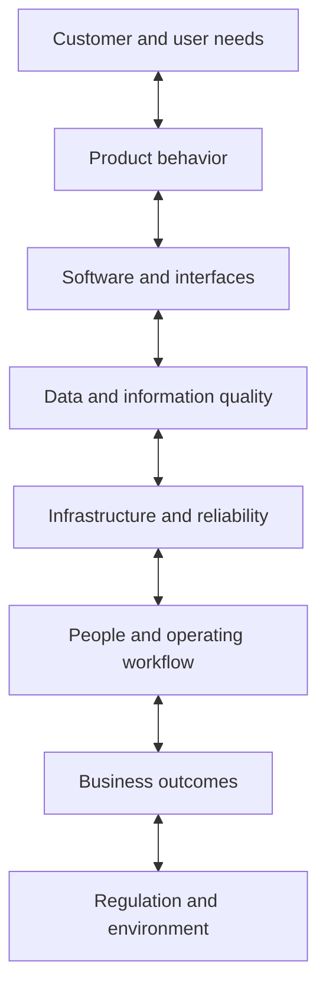

# Systems thinking for product managers

[← Catalogue](README.md) · [Decision approach](approach.md)

**A product decision can improve one part of a system while creating costs or risks elsewhere.** I make those connections part of the product conversation.

## Apply it to a concrete choice

The examples below are design considerations for the concept cases. They are not observed outcomes.

| Choice | Intended benefit | Second-order effects to examine | Useful validation |
|---|---|---|---|
| AI-assisted extraction | Less manual information sorting | Unsupported suggestions, review workload, data exposure, inference cost | Labeled task evaluation plus timed reviewer comparison |
| Structured clinical intake | More complete records and traceable handoffs | Additional entry friction, exception handling, identity errors | Synthetic workflow walkthroughs and completeness checks |
| Continuous asset monitoring | Earlier visibility of abnormal behavior | Sensor availability, bandwidth, false alarms, technician workload | Replay representative signals and trial alert handling |
| Extra pickup verification | Stronger release control | Queue delays, recovery steps, staff effort | Scenario tests for normal pickup, revoked permissions, and outages |

## Trace a need into product behavior

For Safe School Pickup, a proposed traceability chain is:

**Authorized pickup only → Current guardian permission → Release authorization check → Staff-confirmed release → Revocation and mismatch scenario tests**

GPS proximity can support queue coordination. It does not establish identity or authorize release.

## Keep the engineering relevant

Architecture is useful when it explains a product choice: a durable queue because a handoff must survive an outage; an audit trail because a workflow must be reconstructed; a simpler model because data and explainability constrain the MVP.

I keep detailed interfaces, requirements, risk analysis, and evaluation methods in a technical appendix. The main narrative explains what they mean for the user, operating team, and product outcome.

[Inspect the traceability and risk templates →](templates/product-artifacts.md)
